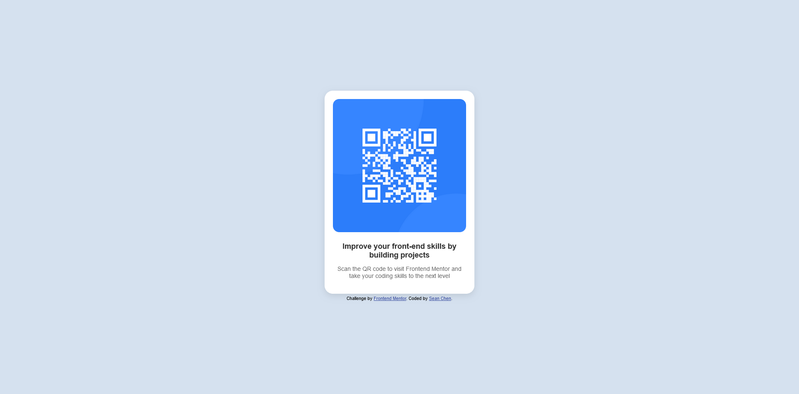

# Frontend Mentor - QR code component solution

## Table of contents

- [Overview](#overview)
  - [Screenshot](#screenshot)
  - [Links](#links)
- [My process](#my-process)
  - [Built with](#built-with)
  - [What I learned](#what-i-learned)
  - [Continued development](#continued-development)
- [Author](#author)

## Overview

### Screenshot

### Links

- Solution URL: [GitHub](https://github.com/chenmeister/qr-code-component)
- Live Site URL: [Add live site URL here](https://your-live-site-url.com)

## My process

### Built with

- HTML
- CSS utilizing flex

### What I learned

This challenge was a refresher for me on how to build a simple webpage utilizing pure HTML and CSS. Writing CSS from scratch was a bit challenging since it's been a long time. 

### Continued development

Although this was not a difficult challenge, it really forced me to brush up my CSS skills instead of heavily relying on CSS frameworks too much.

## Author

- Website - [Add your name here](https://www.your-site.com)
- Frontend Mentor - [@yourusername](https://www.frontendmentor.io/profile/yourusername)
- Linkedin - [Sean Chen](https://www.twitter.com/yourusername)
